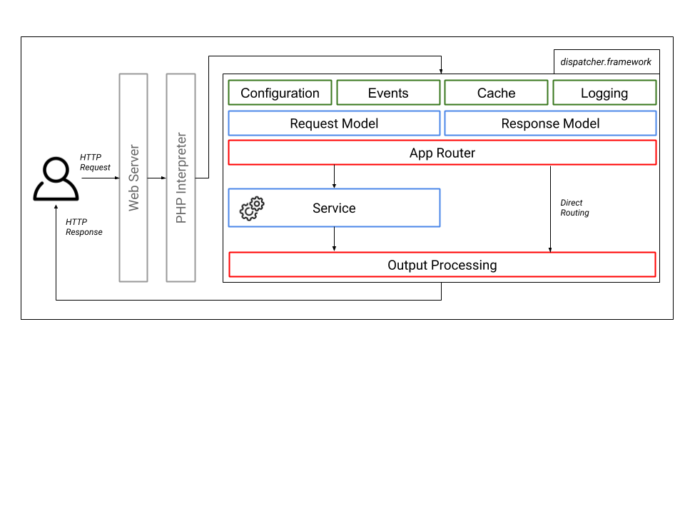

General Concepts
================

.. _comodojo/installer package: https://github.com/comodojo/comodojo-installer
.. _comodojo/cache package: https://github.com/comodojo/cache

The dispatcher framework is a library designed to be extensible and hackable enough to support the development of web resources, from plain REST services/APIs to web application.

Unless other complex and wider frameworks, it offers only the minimal set of tools to process and respond to web requests, leaving to the developer the choice to use one programming pattern or another, one library or another equivalent one.

This minimal set of features currently includes:

- web calls modelling (from request to response);
- service models;
- application routing (using extended regular expressions);
- events management and delegation;
- HTTP post processing (content, headers and status code);
- resource caching;
- auto packaging (bundles) and configuration.

.. _general-web-calls-modelling:

Web calls modelling
-------------------

Once started (i.e. when a new HTTP request hits the web server that sends is to the dispatcher engine), the dispatcher starts immediately creating models for the request, the routing engine and the response, plus a couple of classes for configuration, extra parameters, cache and events. In other words, the entire workflow from a request to the response is mapped to the internal dispatcher functional schema, accessible using internal APIs.

In the middle of this workflow there is the service with its business logic, that has to run to provide value to the client.

    comodojo/dispatcher-framework v4.X architecture

The service and the event listeners are the only entities that can interact with the models' APIs to create the output.

.. _general-service-models:

Service models
--------------

Services are the central point of framework’s logic: they are independent, callable php classes that may return data (in any form) or errors (exception).

.. note:: A dispatcher instance is a sort of multi-service container; services can be grouped in bundles (packages) with auto-describing metadata and installed automatically. This way installing or removing a bundle should never stop or interfere with other bundles or the dispatcher itself.

Services a created on top of the service model that:

- defines basic components for the service (e.g. http verbs support);
- provides complete access to all the framework's functionalities.

A service is selected evaluating a route definition in the routing table (see next paragraph). However, *services and routes are completely separated*. It means that a single service may be reached via multiple routes and it’s life does not depend on any of them.

For more information about services, jump to the :ref:`services` section.

.. _general-app-routing:

Application routing
-------------------

The dispatcher framework includes an advanced URL router that maps urls to services and allows users to describe routes using regular expressions, evaluate and convert url paths into parameters.

Since the services and the routes are loosely coupled, the dispatcher's app router acts more or less like an IP router: it owns a routing table that is queried to determine where to forward the execution flows (which class is responsible for what route) and expects a return value from it, but nothing more.

Also, the configuration of the routing table is not included in the service classes, but in a specific configuration file that is loaded and cached at boot time.

For more information about the dispatcher app router, jump to the :ref:`router` section.

Additionally, to support automatic configuration and packaging, definition of routes can be included in the bundle metadata and processed by the `comodojo/installer package`_  (see :ref:`general-auto-packaging`).

.. _general-events-management:

Events management
-----------------

Dispatcher is an event-based framework: at every step of its lifecycle dispatcher is emitting events, and event listeners (plugins) can be used to hook to the events, access the framework APIs and change its behaviour. This means that a plugin can change almost everything in the framework, even the request object.

Let's consider a couple of common use cases.

.. topic:: Authenticating requests

    In a typical scenario, a subset of the exposed servics requires the client to be authenticated using a JWT token to consume the data.

    Dispatcher does not include authentication out of the box, but a custom one (or perhaps an external library) can be integrated using events. To perform the authentication without changing the service specs, a custom listener could:

    - catch the *dispatcher.route* event;
    - determine the service route;
    - check if the service requires authentication;
    - perform authentication and, in case, raise a 401 Unauthorized HTTP error.

.. topic:: Change output encoding

    If one of your client does not support the default output encoding of a service, you can write a plugin to:

    - catch the *dispatcher.response* event;
    - check if the output should be changed according to the client's IP or name;
    - in case, change the output encoding.

    Also in this case there is no need to change the service specs, but just hack the dispatcher to behave differently for the particular source.

As for the services, plugins can be packed in bundles, reused and auto-installed by the `comodojo/installer package`_.

For more information about events, jump to the :ref:`events` section.

.. _general-http-post-processing:

HTTP post processing
--------------------

TBW

.. _general-resource-caching:

Resource caching
----------------

Dispatcher is shipped with the `comodojo/cache package`_ that is responsible to:

- cache internal structures (e.g. the routing table);
- cache (if required) output data (server side);
- cache user-defined data.

About output data, dispatcher will check if (i) the service is configured support cache and (ii) the HTTP verb allows caching. In this case, the complete result object will be stored in the cache provider and used to build the response to the next similar requests.

.. notice:: The important thing to notice is that the service class should not care about result caching, so there is no need to write extra code in the service implementation to enable the feature. And since the complete result object is stored in the cache provider, every post-processing routine or listener can continue to work without knowing if the data comes from a service-run or the cache.

For more information about resource caching, jump to the :ref:`services-cache` section.

.. _general-auto-packaging:

Auto packaging and auto configuration
-------------------------------------

TBW
